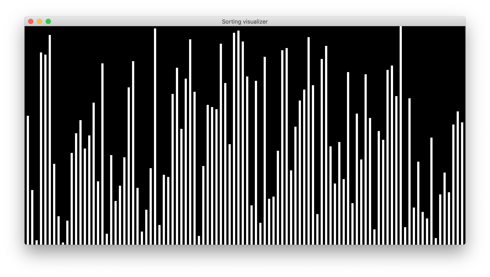
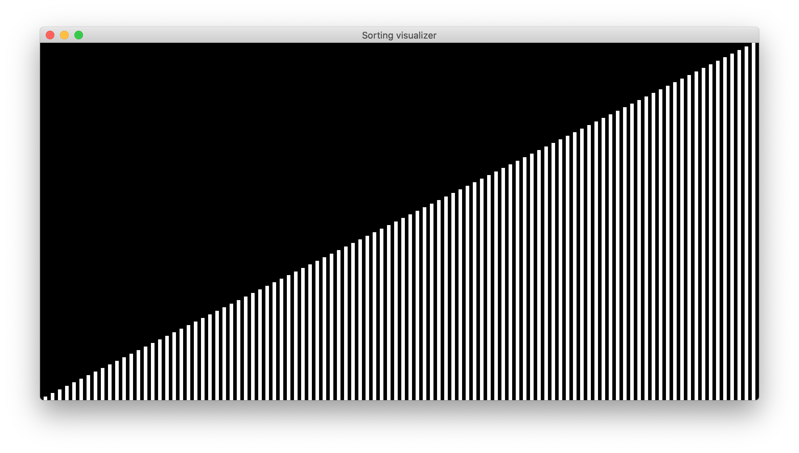

# SortVisualizer

Visualizes and animates common sorting algorithms using Java and Swing.

## Concept

There are many different algorithms for sorting data, each with different expectations of time complexity in various scenarios. Visualizing how the algorithms sort through a shuffled data set can help to explain how each algorithm works.

Unsorted data can be represented as a set of bars with varied heights:

After being sorted, the set looks like this:

## Algorithms
* Bubble sort
* Selection sort
* Merge sort
* Quick sort
* Counting sort
* Radix sort
